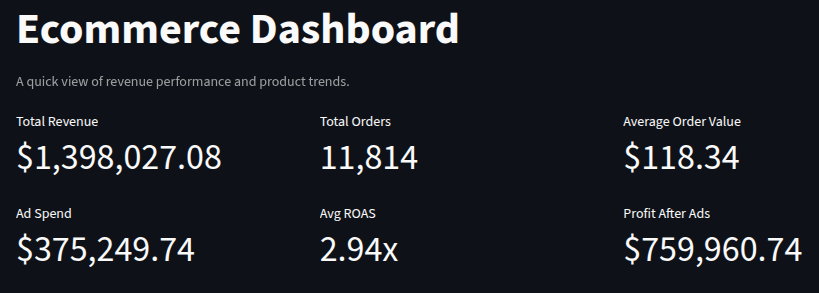
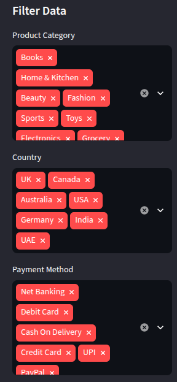
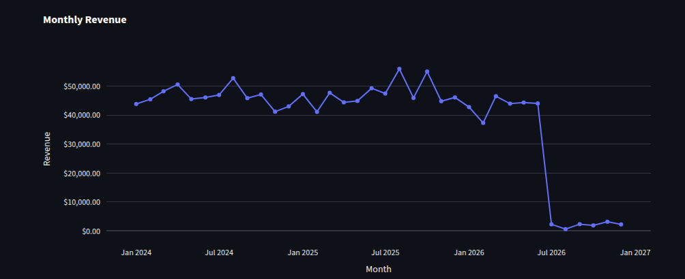
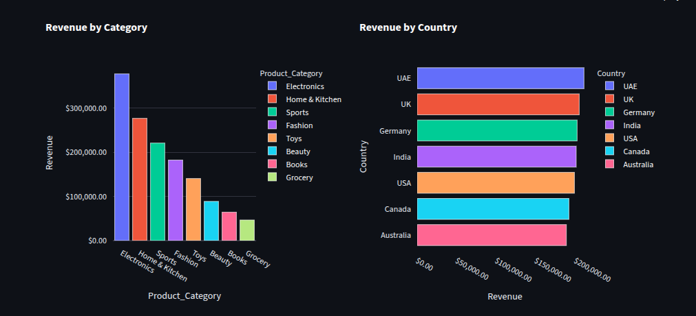
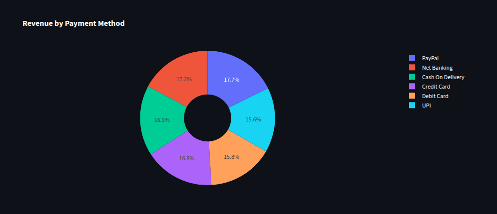
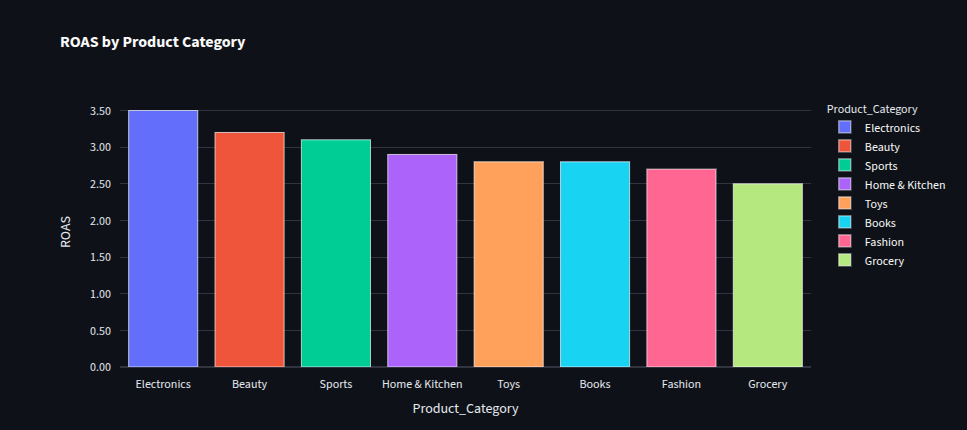
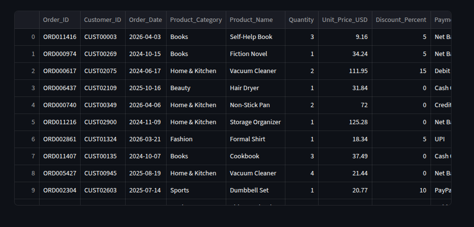

# E-commerce Sales & Ad Spend Dashboard

[](https://www.python.org/downloads/)
[](https://streamlit.io/)
[](https://www.microsoft.com/en-us/microsoft-365/excel)

A complete data analytics project that turns messy e-commerce transaction data into a professional, interactive business dashboard. Built for freelancers and analysts who need to deliver **client‑ready insights fast**.

---

## 🚀 What It Does

This project takes 12,000+ rows of raw e‑commerce transactions and advertising spend data, cleans them, calculates key business metrics, and delivers **two interactive dashboards** – one in Excel (manually polished with slicers and dark theme) and one as a web app (Streamlit).

### 📊 Two Delivery Formats

**1. Excel Dashboard (Showcase)**  
`dashboard.xlsx` – a fully formatted workbook with:
- **5 PivotCharts**: Revenue by Category & Status, Revenue by Country, Revenue by Payment Method, Monthly Revenue Trend, ROAS by Category.
- **4 Slicers**: Filter by Product Category, Country, Payment Method, and Revenue Type (Fulfilled vs. Cancelled).
- **Dark Theme**: Professional black background with white text, optimised for live client demos.
- *Just open the file and start filtering – no setup required.*

**2. Streamlit Web App (Interactive)**  
Run `streamlit run app.py` locally to explore the same insights in a web interface with sidebar filters – ideal for quick internal exploration.

### 📊 Key Metrics Calculated

| Metric | Value |
|--------|-------|
| **Total Revenue** | $1.40M |
| **Fulfilled Revenue** | $1.15M |
| **Cancelled/Returned Revenue** | $253K |
| **Total Ad Spend** | $375K |
| **Overall ROAS** | 2.94x |
| **Profit After Ads** | $760K |

---

## 📸 Dashboard Preview

### Excel Dashboard

| KPI Cards | Slicers |
|---|---|
|  |  |

| Monthly Revenue Trend | ROAS by Category |
|---|---|
|  |  |

| Revenue by Payment Method | Revenue by Country |
|---|---|
|  |  |

| Revenue by Category & Status |
|---|
|  |

### Streamlit Web App

| Header & KPIs | Filters Sidebar |
|---|---|
|  |  |

| Monthly Revenue Trend | Revenue by Category & Country |
|---|---|
|  |  |

| Revenue by Payment Method | ROAS by Category |
|---|---|
|  |  |

| Data Table Preview |
|---|
|  |

### Data Cleaning — Before & After

| Before | After |
|---|---|
|  |  |

---

## 🧼 The Cleaning Problem

The raw export arrives inconsistent — the kind of file that breaks naive group-bys. The cleaning layer normalizes:

- **Payment methods** — `Net Banking`, `NetBanking`, `net banking` → one canonical value. Same for `5 Debit Card`, `5 debit card`, `DEBIT CARD` → `Debit Card`.
- **Countries** — `USA`, `U.S.A`, `United States`, `usa` → `USA`. Same for `UK` / `U.K.` / `United Kingdom`.
- **Order status** — mapped into two reporting buckets: `Fulfilled` and `Cancelled/Returned`.
- **Derived columns** — `Revenue` per line, and a `Month` period key for time-series aggregation.

---

## 🛠️ Setup & Reproduce

```bash
git clone https://github.com/MashhudFarah/Data-Analysis-Projects.git
cd Data-Analysis-Projects

# Install dependencies
pip install -r requirements.txt

# Step 1 — clean the raw transactions → produces clean_data.xlsx
python clean_data_script.py

# Step 2 — build the Excel deliverable → produces dashboard.xlsx
python build_dashboard.py

# Step 3 — launch the interactive web app
streamlit run app.py
```

**Requirements:** Python 3.9+, `pandas`, `openpyxl`, `streamlit`, `plotly` (see `requirements.txt`).

Steps 2 and 3 both read from `clean_data.xlsx`, so **step 1 must run first**.

---

## 📁 Project Structure

```bash
Data-Analysis-Projects/
├── README.md                      # Project documentation
├── LICENSE                        # MIT
├── .gitignore                     # Excludes clean_data.xlsx and caches
├── requirements.txt               # Python dependencies
│
├── 📊 ad_spend.csv                # Source: daily ad spend by category
├── 📊 messy_data.csv              # Source: raw e-commerce transactions
│
├── 📄 clean_data_script.py        # Step 1: Clean messy_data.csv → clean_data.xlsx
├── 📄 build_dashboard.py          # Step 2: Build Excel deliverable (dashboard.xlsx)
├── 📄 app.py                      # Step 3: Streamlit web app (interactive version)
│
├── 🔧 clean_data.xlsx             # Generated intermediate (ignored by Git)
├── 🏆 dashboard.xlsx              # Final polished Excel dashboard (tracked)
│
└── screenshots/
    ├── excel/                     # Excel dashboard + before/after cleaning shots
    └── webapp/                    # Streamlit web app screenshots
```

`clean_data.xlsx` is fully regenerable from `clean_data_script.py` and is **not** tracked in Git. `dashboard.xlsx` is tracked because it's a deliverable, not an intermediate.

---

## 🧾 License

Released under the MIT License — see [LICENSE](LICENSE).

---

## 👤 Author

**Mashhud Farah** — [github.com/MashhudFarah](https://github.com/MashhudFarah)
